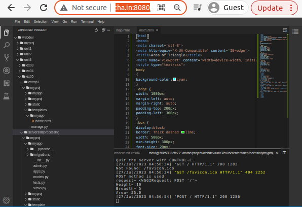
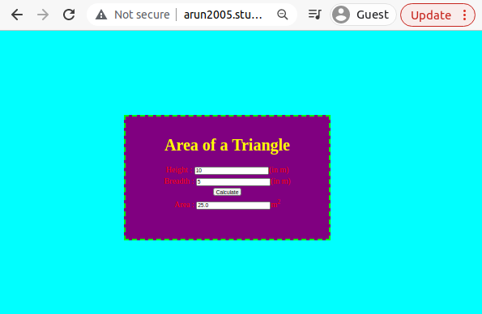

# Design a Website for Server Side Processing

## AIM:
To design a website to perform mathematical calculations in server side.

## DESIGN STEPS:

### Step 1:
Clone the repository from GitHub


### Step 2:
Create Django Admin project.


### Step 3:
Create a New App.


### Step 4:
Create python programs for views and urls.


### Step 5:
Create a HTML file of forms.


### Step 6:

Publish the website in the given URL.

## PROGRAM :
```
math.html

<IDOCTYPE html>

<html lang="en">

<head>

<title>My City</title>

</head>

<body>

ch1 align="center">

<font color="red"><b>cuddalore,-Cement City</b></font>

</h1>

ch3 align="center">

<font color="blue"><b>Saniel T (22009315)</b></font>

</h3>

<center>


<map name="MyC

carea shape="circle" coords="190,50,20" href="/static/html/ghs.html" title="Govt. Higher Secondary

School">

<area shape="rectangle" coords="230,30,260,60" brefa"/static/html/rto.html" title="RTO Office">

carea shape "circle" coords"400,350,50" href="/static/html/vk.html" title="Washerman's Lake">

<area shape="circle" coords="400,200,75" href="/static/html/bus.html" title="Hi-Tech Bus Stand">
<area shape="rectangle" coords="490,150,870,320" href="/static/html/park.html" title="Eco-Park">

</map>

</center>

</body>

</html>


views.py

from django.shortcuts import render
from django.template  import loader
from django.shortcuts import render
# Create your views here.


def triarea(request):
    context={}
    context['area'] = "0"
    context['h'] = "0"
    context['b'] = "0"
    if request.method == 'POST':
        print("POST method is used")
        h = request.POST.get('height','0')
        b = request.POST.get('breadth','0')
        print('request=',request)
        print('Height=',h)
        print('Breadth=',b)
        area = 0.5*int(h) * int(b)
        context['area'] = area
        context['h'] = h
        context['b'] = b
        print('Area=',area)
    return render(request,'myapp/math.html',context)


urls.py

from django.contrib import admin
from django.urls import path
from myapp import views


urlpatterns = [
    path('admin/', admin.site.urls),
    path('areaoftriangle/',views.triarea,name="areaofrectangle"),
    path('',views.triarea,name="areaoftriangleroot")
]
```
## OUTPUT:


### Home Page:


## Result:
The program for implementing server side processing is completed successfully.
